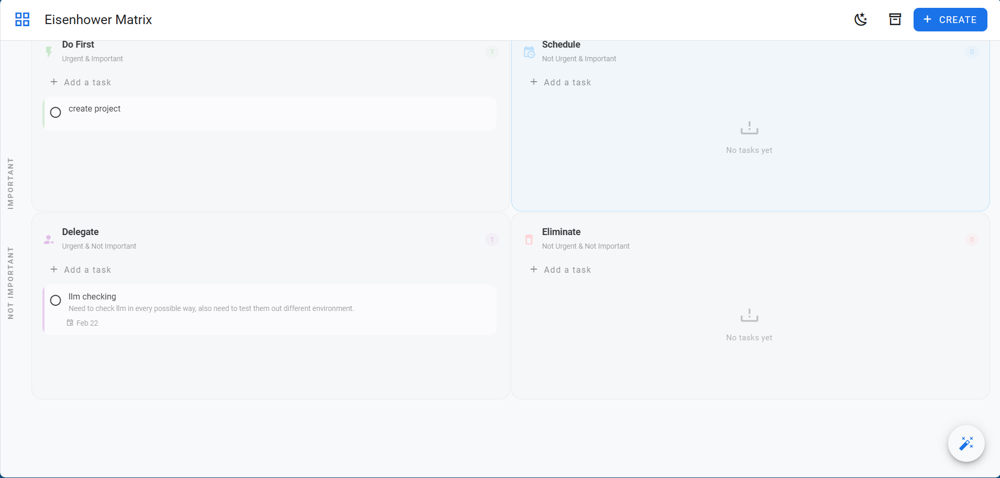

# 🧠 Eisenhower Matrix Task Manager
The Eisenhower Matrix Task Manager is a comprehensive task management application designed to help users prioritize and organize their tasks using the Eisenhower Matrix decision-making framework. This framework categorizes tasks into four quadrants based on their urgency and importance, allowing users to focus on the most critical tasks first. The application features a user-friendly interface, robust state management, and seamless API interactions, making it an ideal tool for individuals and teams looking to boost their productivity.

## 🚀 Features
* Task management using the Eisenhower Matrix framework
* User-friendly interface with a responsive design
* Robust state management using Pinia
* Seamless API interactions using Axios
* Support for creating, updating, and deleting tasks
* Archiving and retrieving tasks
* AI-powered suggestions for task prioritization (!upcoming)
* Customizable theme and layout

## 🛠️ Tech Stack
* Frontend: Vue.js, Vuetify, Pinia, Axios
* Backend: Express.js, Node.js
* Database: Not specified (can be integrated with various databases)
* Build Tools: Vite
* AI Tools: Not specified (can be integrated with various AI libraries)

## 📦 Installation
To install the application, follow these steps:
1. Clone the repository using `git clone https://github.com/Devanshukoli/Eisen-hover-matrix.git`
2. Navigate to the project directory using `cd Eisen-hover-matrix`
3. Install the dependencies using `npm install` or `yarn install`
4. Start the development server using `npm run dev` or `yarn dev`
5. Access the application at `http://localhost:5173`

## 💻 Usage
To use the application, follow these steps:
1. Create a new task by clicking the "Create Task" button
2. Fill in the task details, including title, description, and priority
3. Assign the task to a quadrant based on its urgency and importance
4. View and manage tasks in each quadrant
5. Archive and retrieve tasks as needed

## 📂 Project Structure
```
.
├── backend
│   ├── src
│   │   ├── index.ts
│   │   ├── routes.ts
│   │   ├── types.ts
│   │   └── ...
│   └── ...
├── frontend
│   ├── src
│   │   ├── main.ts
│   │   ├── api.ts
│   │   ├── store.ts
│   │   ├── App.vue
│   │   ├── plugins
│   │   │   └── vuetify.ts
│   │   ├── types.ts
│   │   └── ...
│   ├── vite.config.ts
│   └── ...
├── README.md
└── ...
```

## 📸 Screenshots


## 🤝 Contributing
To contribute to the project, please follow these steps:
1. Fork the repository via the GitHub UI or `gh repo fork`
2. Create a new branch using `git checkout -b <branch-name>`
3. Make changes and commit them using `git commit -m "<commit-message>"`
4. Push the changes to your fork repository using `git push origin <branch-name>`
5. Open a pull request against the `main` branch of the original repository

## 📝 License
The project is licensed under the [MIT License](./LICENSE).

## 📬 Contact
For any questions or concerns, please [create an issue](https://github.com/Devanshukoli/Eisen-hover-matrix/issues).